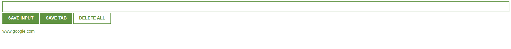

# 📚 Lead Tracker Chrome Extension  
  

## 📌 Project Overview  
This project is a **Lead Tracker Chrome Extension** built using **HTML, CSS, and JavaScript**. It allows users to save URLs for future reference and manage them efficiently. The extension utilizes **localStorage** to store the data, ensuring that the saved links remain intact even after the browser is closed.  

## ✨ Features  
✅ **Save Input URL** – Manually enter and save URLs  
✅ **Save Current Tab** – Save the URL of the current active tab with one click  
✅ **Delete All** – Clear all saved URLs effortlessly  
✅ **Persistent Storage** – Data is stored using localStorage  
✅ **Minimal & Intuitive UI** – Simple and easy-to-use interface  

## 🔧 Tech Stack  
- **Frontend:** HTML, CSS, JavaScript  
- **Storage:** LocalStorage  

## 🚀 Upcoming Features  
🔹 **Export Data** – Ability to download saved URLs as a CSV file  
🔹 **Dark Mode** – Option to switch between light and dark themes  
🔹 **Custom Tagging** – Add tags for better URL categorization  
🔹 **Sync Across Devices** – Sync data across multiple devices  

## 📽️ Project Demo  
### 🎥 Watch on YouTube  
[](https://youtu.be/bhIezEw5GbY)  

## 📂 Installation & Usage  
1. Clone this repository:  
   ```bash
   git clone https://github.com/M-Meeran-Siddiqui/Lead-Tracker-Chrome-Extension-.git
   ```
2. Open Chrome and navigate to:  
   ```
   chrome://extensions/
   ```
3. Enable **Developer Mode** in the top right corner.  
4. Click **Load unpacked** and select the project folder.  
5. Start using the extension!
